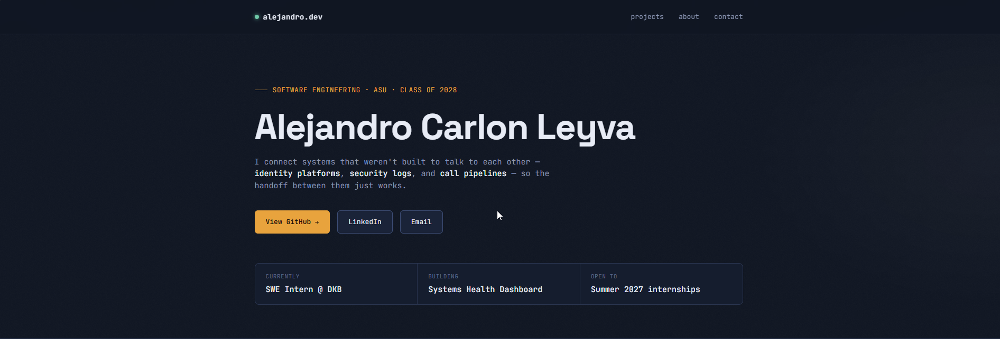

# Alejandro Carlon Leyva — Portfolio

My personal portfolio site — a look at what I'm building as a Software Engineering student at ASU and SWE intern at Diamond Kitchen and Bath.

🔗 **Live site:** [alejandrocarlon03.github.io/portfolio](https://alejandrocarlon03.github.io/portfolio/)

## Built with

Plain HTML, CSS, and vanilla JS — no framework, no build step. Deployed on GitHub Pages.

## Featured projects

- **[SnipeSync](https://github.com/AlejandroCarlon03/SnipeSync)** — automated employee lifecycle sync between Entra ID and Snipe-IT
- **[EntraSecurityWatcher](https://github.com/AlejandroCarlon03/EntraSecurityWatcher)** — live monitoring dashboard for privileged-access changes in Entra ID
- **[LeadRouter](https://github.com/AlejandroCarlon03/dkb-retell-odoo-integration)** — AI phone agent that routes inbound calls straight into a CRM lead
- **[Slay the Spire 2 Analytics Dashboard](https://github.com/AlejandroCarlon03/sts2-game-analyzer)** — personal project analyzing run history and deck performance

## Contact

- [LinkedIn](https://www.linkedin.com/in/alex-carlon-leyva-626912230)
- [Email](mailto:Alex.carlon26@gmail.com)
